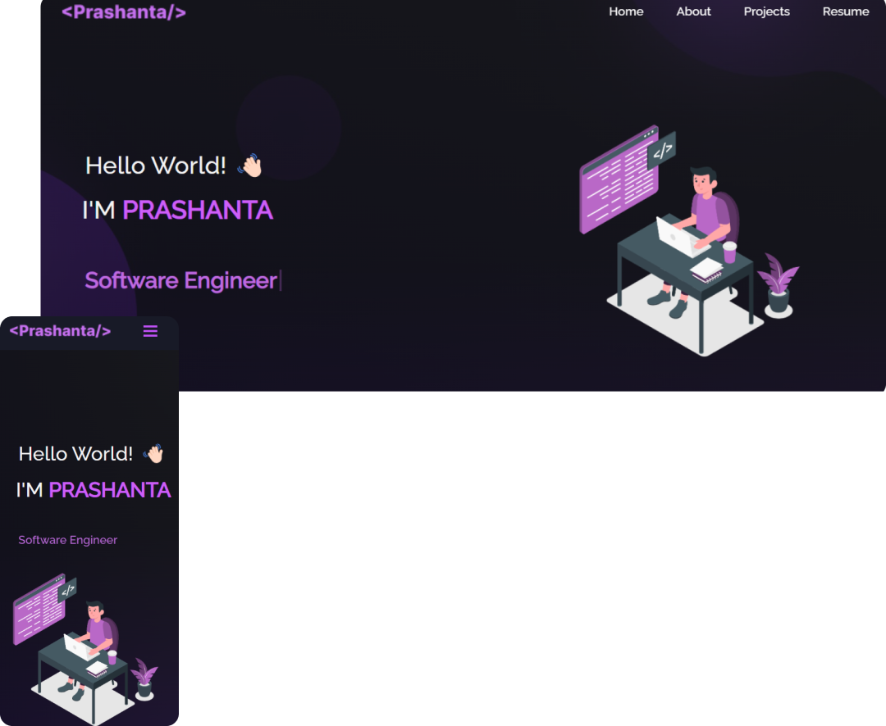

  
  
  
  
  

  

<h2  id="header" align="center">
  <a  href="http://prasanto19.github.io/portfolio" >My Portfolio Website</a>
</h2>

  

 

## Built With

This is my personal <a href="http://prasanto19.github.io/portfolio" target="_blank">portfolio website</a> 
which features some of my github projects as well as my resume and technical skills. 
It's a self developed personal project created using create-react-app with react.js.

This portfolio was built using these technologies.

- React.js
- CSS3
- VsCode
- Git

## Features

**📖 Multi-Page Layout**

**🎨 Styled with React-Bootstrap and Css with easy to customize colors**

**🎨What I have used**
  
- Make small components of every part of o page 
- Functional Component 
- Props rendering
- Import files
- Arrow functions
- State management using hook
- Manage code with version control(git)
- Integrate eslint with prettier for auto formatting 
- Use additional yarn scripts for creating beautiful UI 
- Finally deploy it on github pages.

**📱 Fully Responsive**

### Show your support

Give me a ⭐ if you like this website!
